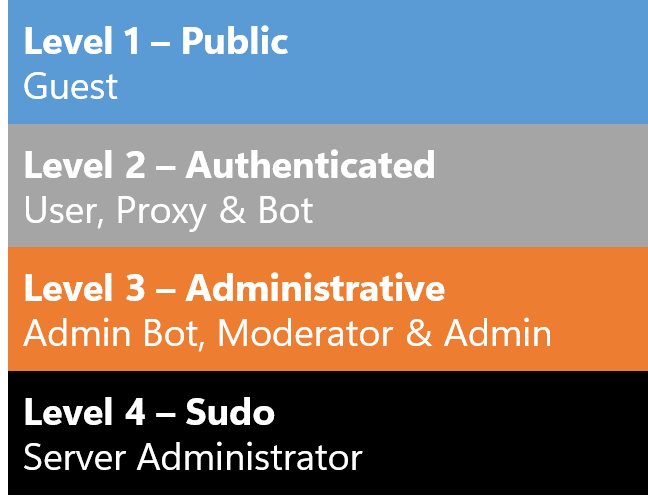

# Permission Sets

**This feature is not complete and not fully implemented yet**

Permission sets flags are a way to tell the client what
permissions it currently has with the network, methods will
specify what permissions are required to execute the method.

## Permission Levels

It's easy to identify these permissions by levels, permissions
like `USER`, `PROXY` & `BOT` are generally required to be authenticated,
it doesn't mean that `BOT` and `PROXY` can use all the methods
that `USER` has access to, but anything higher such as `ADMINISTRATOR_BOT`
can access all methods that `USER`, `PROXY` and `BOT` can or even
more. Methods will specify the permission requirements for example a
method may be accesiable to `USER` and `BOT` which means `PROXY` peers
cannot use the method but anything higher such as `ADMINISTRATOR` can
access the method even if not specified.

The same way `MODERATOR` has greater permissions than `USER` but does
not have access to the same methods as `ADMINISTRATOR` but `ADMINISTRATOR`
may have access to `MODERATOR` methods.

Permissions can also affect the rate limit for methods and requests, for
example proxy peers will have a less restrictive rate limit for composing
posts than a user does since a proxy peer's purpose is to mirror content
from other sources while a user peer is not expected to post as frequent
as a proxy or bot peer.

| Flag                   | Description                                                                                                                                                                                                                                                                                                                                                                                                                                           |
|------------------------|-------------------------------------------------------------------------------------------------------------------------------------------------------------------------------------------------------------------------------------------------------------------------------------------------------------------------------------------------------------------------------------------------------------------------------------------------------|
| `GUEST`                | Guest permissions allows the execution of methods without requiring authentication. Read-only mode                                                                                                                                                                                                                                                                                                                                                    |
| `USER`                 | User permissions allow the execution of user methods and interactivity with the network and other peers                                                                                                                                                                                                                                                                                                                                               |
| `PROXY`                | Proxy permissions are much like user permissions but are restricted to proxy related methods, the server does not treat proxy peers the same as users. Proxy peers should not be allowed to interact with other peers on it's own and simply serves the purpose of providing content to the network (much like a bridge for Twitter, Telegram or other service)                                                                                       |
| `BOT`                  | Bot permissions are much like user permissions but are restricted to bot related methods, the server does not treat bot peers the same as users. Bot peers should not be allowed to interact with other peers on the network unless it's being invoked by a peer, bots can inherit proxy permissions but with additional access to methods and bot exclusive methods for the purpose of providing some sort of automated interactivity on the network |
| `ADMINISTRATOR_BOT`    | An administrator bot inherits bot, moderator and administrator permissions which can have unrestricted access to other methods or means of listening to events that would be useful for the network, such as a bot that posts updates at a interval about server events or acts accordingly to events going on in the server. These are usually back-end related bots.                                                                                |
| `MODERATOR`            | Moderator permissions grants the same permissions as user but access to methods that permits the peer to preform moderation tasks on the server such as removing posts, warning peers and so on.                                                                                                                                                                                                                                                      |
| `ADMINISTRATOR`        | Administrator permissions inherits user & moderator permissions but has the ability to grant manage peers, moderators, change network settings and so on.                                                                                                                                                                                                                                                                                             |
| `SERVER_ADMINISTRATOR` | The highest permission available, inherits user, moderator and administrator permissions but also grants special access to methods that could otherwise be dangerous. Should only be granted to one peer that is only used by the server and not by a human.                                                                                                                                                                                          |